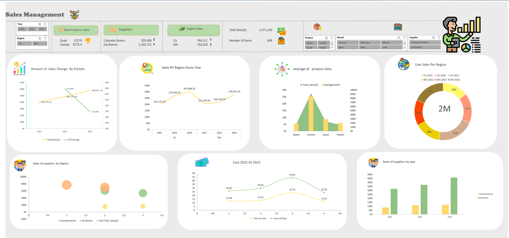

<h1> Sales Dashboard 😊</h1>
<p1>A Dashboard for sales Data </p1>
<ul>
 <li> First folder: contain all Dashboard charts and images 📂.</li>
 <li> Second folder: contain the data of the project 📄 .</li>
 <li> sales_Dashboard.htm file You can download the project and open this file on your pc you will show the dashboard and workbench of Excel.</li>
<li>  sales.xlsx the main file contains all pivot tables and you can work on it too 🔎.</li>
</ul>
<p1>This readme file provides an overview of the sales analysis project, including the questions it aims to answer and the information it provides. The sales analysis project focuses on understanding and analyzing sales data over time and across different regions.

<h2>Questions to be Answered 👇🏽</h2>
<li>Year-over-Year (YoY) Change of Total Sales: This analysis will calculate and provide the percentage change in total sales from one year to another. It helps in understanding the overall growth or decline in sales over time.</li>

<li>Region Sales by Year: This analysis will provide the sales figures for each region in specific years, such as 2021, 2022, and 2023.
 It helps in identifying the sales performance of different regions over time.</li>

<li>Sales of Products by Region: This analysis will provide the number of sales of each product categorized by region. 
 It helps in understanding the popularity and demand for products in different regions.</li>

<li>Line Sales by Each Region: This analysis will display the sales trends for each region over time using line charts. It helps in visualizing the sales patterns and identifying any significant changes or trends in specific regions.</li>

<li>Difference between the Cost of Sales in 2023 and 2022: This analysis will calculate and provide the difference in the cost of sales between the years 2023 and 2022. It helps in understanding the cost fluctuations over time and their impact on profitability.</li>

<h3>Additional Notes ✍🏽</h3>
<p1>Ensure the data used for the analysis is accurate, complete, and up-to-date.
Consider applying appropriate data cleaning and preprocessing techniques if necessary.
Use clear and concise visualizations to present the results effectively.</p1>

<ul>
 <li> First folder: contain all Dashboard charts and images 📂.</li>
 <li> Second folder: contain the data of the project 📄 .</li>
 <li> sales_Dashboard.htm file You can download the project and open this file on your pc you will show the dashboard and workbench of Excel.</li>
<li>  sales.xlsx the main file contains all pivot tables and you can work on it too 🔎.</li>
</ul>

</p1>
  <h2> Here is the Sales Dashboard 😇</h2>
  

  

