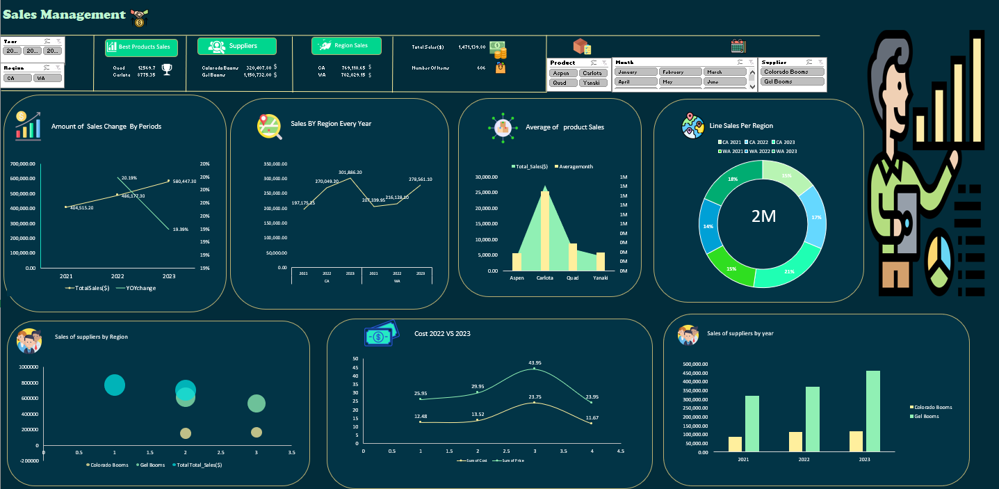

<h1> Sales Dashboard 😊</h1>
<p1>A Dashboard for sales Data </p1>
<ul>
 <li> First folder: contain all Dashboard charts and images 📂.</li>
 <li> Second folder: contain the data of the project 📄 .</li>
 <li> sales_Dashboard.htm file You can download the project and open this file on your pc you will show the dashboard and workbench of Excel.</li>
<li>  sales.xlsx the main file contains all pivot tables and you can work on it too 🔎.</li>
</ul>
  <h2> Here is the Sales Dashboard 😇</h2>
  

  

